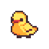
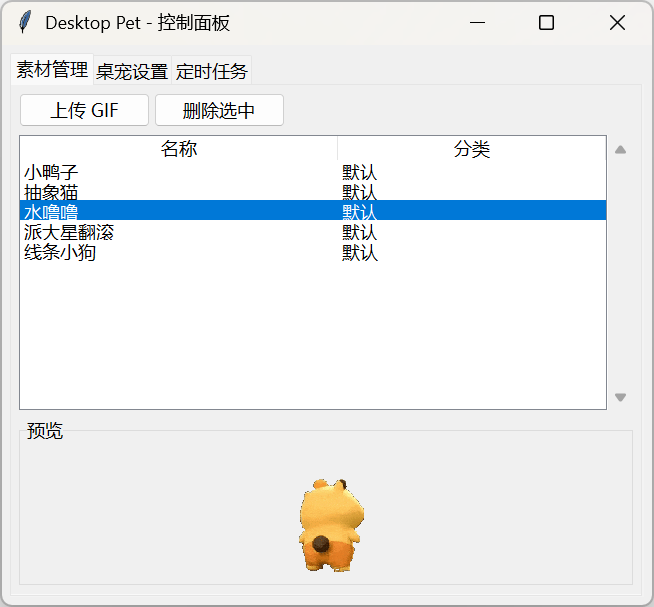
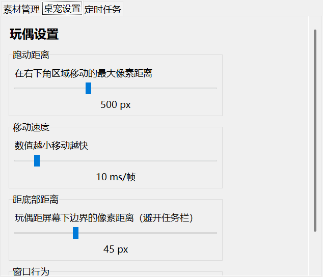
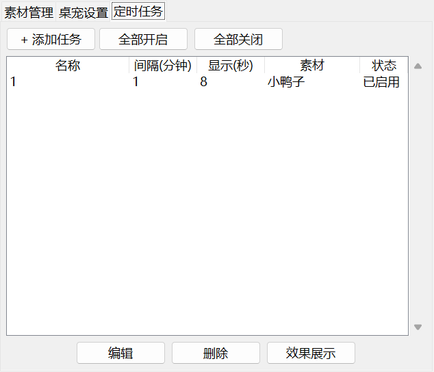

# 桌萌提醒 — DeskPet

<div align="center">



*A cute desktop pet that walks across your screen and reminds you to take breaks!*

</div>

---

## 项目起源

本项目受 [wkostusiak/desktop-pet](https://github.com/wkostusiak/desktop-pet) 启发，在其基础上扩展为功能更完整的桌面萌宠提醒工具。原项目展示了一个在桌面滑动的 GIF 动画，本项目在此基础上新增了：

- 可视化控制面板（素材管理、桌宠设置、定时任务）
- 多任务定时调度（每个任务独立间隔、时长、缩放）
- 系统托盘集成（开机自启、最小化不占任务栏）
- 三层叠加预览（新建任务时实时对比不同尺寸的缩放效果）
- 素材拖拽上传与分类管理

---

## 功能特点

- **定时提醒** — 可配置多个定时任务，间隔弹出 GIF 动画提醒喝水、护眼、活动
- **素材管理** — 上传、删除 GIF 素材，分类管理
- **实时预览** — 新建/编辑任务时，三层叠加预览框（∗1/∗2/∗3）实时展示缩放效果
- **桌宠动画** — GIF 动画从屏幕右侧滑入，贴边移动，完全透明无边框
- **系统托盘** — 最小化到托盘，不占任务栏，自启动可配置
- **灵活缩放** — 每个任务独立设置缩放比例（10%~400%）
- **绿色轻量** — 纯 Python + tkinter + PIL，无额外依赖

---

## 界面预览

> 将截图保存到 `assets/screenshots/` 目录后替换下方路径

### 控制面板 — 素材管理


### 控制面板 — 桌宠设置


### 控制面板 — 定时任务


### 桌宠效果展示


---

## 目录结构

```
desktop-pet/
├── assets/
│   ├── gifs/          ← 默认 GIF 素材（小鸭子、抽象猫、水噜噜、派大星翻滚、线条小狗）
│   ├── icon.ico       ← 程序图标
│   ├── tray-icon.png  ← 托盘图标
│   └── screenshots/   ← 截图
├── main.py            ← 程序入口
├── config_manager.py  ← 配置管理（JSON 持久化到 %APPDATA%/desktop-pet/）
├── control_panel.py   ← 控制面板 GUI（tkinter）
├── doll_window.py     ← 玩偶窗口（透明 GIF 动画）
├── scheduler.py       ← 定时任务调度器
├── tray.py            ← 系统托盘
└── build.bat          ← 打包脚本（Windows）
```

---

## 快速开始

### 1. 直接运行源码

```bash
# 需要 Python 3.11+
pip install pystray Pillow tkinterdnd2

python main.py
```

### 2. 打包为 EXE（无环境电脑直接运行）

双击 `build.bat`，完成后在 `dist/DesktopPet.exe` 找到单文件 EXE。

### 3. 直接使用（免安装）

项目已预置打包好的 EXE，无需任何环境：

```
desktop-pet/dist/DesktopPet.exe
```

直接双击即可运行，无需安装 Python 或任何依赖。

---

## 使用说明

### 添加定时任务

1. 打开控制面板 → **定时任务** 标签
2. 点击 **+ 添加任务**
3. 设置任务名称、提醒间隔（分钟）、显示时长（秒）
4. 点击素材卡片选择 GIF，拖动滑块实时预览缩放效果
5. 勾选"创建后立即启用"→ **确定**
6. 新建后**立即弹出**效果，之后按间隔自动重复

### 桌宠设置

| 设置项 | 说明 |
|--------|------|
| 跑动距离 | 在右下角区域移动的最大像素（100~1200） |
| 移动速度 | 帧间隔，越小越快（2~80 ms/帧） |
| 距底部距离 | 避开任务栏的边距（0~150 px） |
| 窗口置顶 | 始终在其它窗口上方 |

### 系统托盘

- **打开控制面板** — 双击托盘图标或右键菜单
- **开机自启** — 右键菜单切换
- **退出程序** — 右键菜单"退出"，任务栏关闭不会退出程序

---

## 配置位置

所有数据保存在用户目录下，卸载程序不影响配置：

```
%APPDATA%/desktop-pet/
├── config.json   ← 任务、设置、素材元数据
└── media/        ← 上传的 GIF 文件
```

删除 `config.json` 可重置全部配置（素材文件保留）。

---

## 技术栈

- **GUI**: tkinter + ttk
- **系统托盘**: pystray
- **图像处理**: Pillow (PIL)
- **定时**: threading.Timer
- **打包**: PyInstaller
- **拖拽**: tkinterdnd2

---

## License

MIT License
